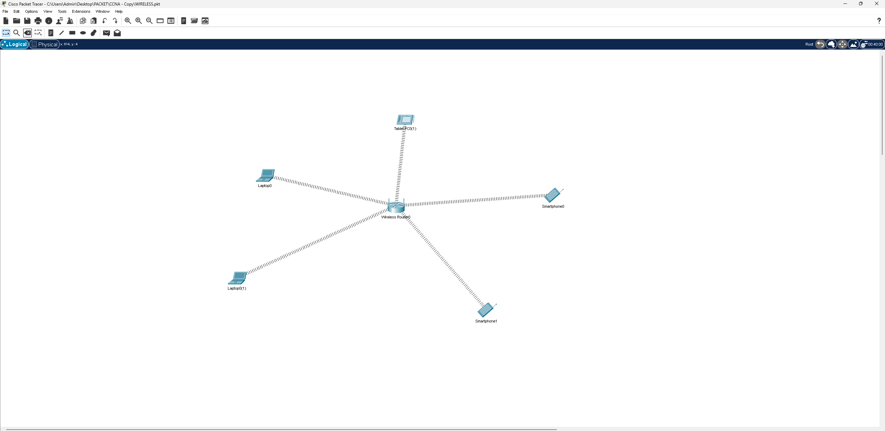

# Wireless Basic – شبكة لاسلكية منزلية/صغيرة بسيطة

## 📖 الوصف
مشروع تأسيسي بسيط يطبق مفهوم **الشبكات اللاسلكية (Wireless Networking)** باستخدام راوتر لاسلكي واحد (**Wireless Router**) يخدم مجموعة من الأجهزة المختلفة لاسلكيًا — مناسب لبيئة منزلية أو مكتب صغير (SOHO).

## 🗺️ التصميم (Topology)

- راوتر لاسلكي مركزي (**Wireless Router0**) يخدم مباشرة:
  - جهازي لابتوب (Laptop0, Laptop0(1))
  - جهازي هاتف ذكي (Smartphone0, Smartphone1)
  - جهاز Tablet PC

جميع الأجهزة تتصل بالراوتر عبر شبكة Wi-Fi واحدة بدون أي أسلاك.

## ⚙️ المفاهيم المطبقة
- إعداد راوتر لاسلكي (Wireless Router) كنقطة وصول ومزود DHCP في نفس الوقت
- ربط أجهزة متنوعة (لابتوبات، هواتف ذكية، أجهزة لوحية) بنفس الشبكة اللاسلكية
- إعداد اسم الشبكة (SSID) وكلمة المرور (WPA2/WEP) لتأمين الاتصال
- التحقق من حصول الأجهزة على عناوين IP تلقائيًا والاتصال ببعضها عبر الشبكة اللاسلكية

## 🎯 الهدف من المشروع
فهم الأساسيات العملية لإعداد شبكة لاسلكية بسيطة تخدم أجهزة متعددة الأنواع، كخطوة تمهيدية قبل الانتقال لمفاهيم أكثر تعقيدًا مثل WLC وإدارة نقاط الوصول المتعددة.

## 📂 الملف
- [`Wireless-Basic.pkt`](./Wireless-Basic.pkt) — ملف Packet Tracer الكامل
